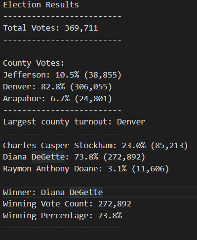

# Election_Analysis

## Overview

We are trying to help Tom, a Colorado board of elections employee conduct an election audit of a US congressional precinct. We are trying to automate the code using Python instead of using excel so that similar audits can be repeatedly conducted with ease on other elections.

## Election - Audit Results

* A total of 369,711 votes were cast in this congressional election
* The county wise breakup of number of votes and percentage of total votes is:
  * Jefferson : 38,855  10.5%
  * Denver    : 306,055 82.8%
  * Arapahoe  : 24,801  6.7%
* Denver had the largest number of votes
* A breakdown of the number of votes and percentage of votes that each candidate received is as follows:
  * Charles Casper Stockham: 85,213 23.0%
  * Diana DeGette: 272,892 73.8%
  * Raymon Anthony Doane: 11,606 3.1%
* Diana DeGette won the election with a winning vote count of 272,892 votes and winning percentage of 73.8%

## Election - Audit Summary

The advantage of using python for the election audit is we can directly use this script to audit any election with similar election results data irrespective of number of counties and number of candidates. Alternatively, we can make certain modifications to the script so that it can used for other elections. One example is that if there is additional data that is present that is needed for the audit, the script reads data into lists and we can use the index of the list to gather the data that is required. Another example is using dictionaries to store the results data so that the dictionary keys can be used to analyze and present the results.
